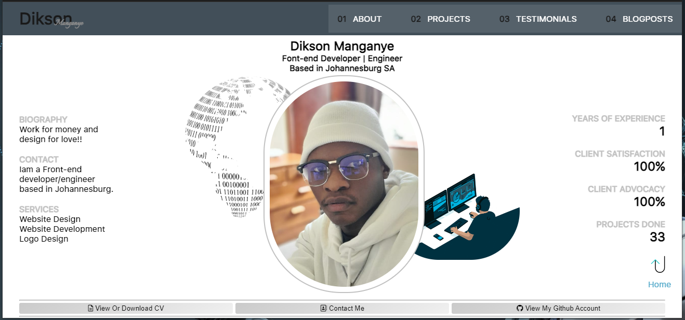

# My Portfolio Website

This portfolio website is a curated, online space that showcases my best work. It's one of the most practical and memorable ways to share my work with press, potential collaborators or employers. The idea is that in just one, centralized space, I can quickly communicate who I am, what I do and how people can contact me. This portfolio website allows me to show a true reflection of my projects, passions and personality.

## Programming Languages
HTML, CSS, JavaScript and Email.js

## Instructions and Usage

The portfolio website is a user-friendly website that can be accessed from the web, hence it does not require any download. Press, potential collaborators or employers can access my personal details (limited to basic details), contact details, skills, experience, projects and also get to now me better.

## Key Features

- Detailed landing page with a bio and more information.
    1. View or download my CV
    2. Contact me link which leads to a page with a number of options for contacting me.
    3. Link to my Github account. 
- About page that consist of:
    1. My introduction and background.
    2. My stack (Programming languages, Frameworks and/or tools).
    3. Social media contacts.
    4. Link to a get to know me personally page.
- Projects page
    1. 3 projects that I did for company (Freelancing).
    2. 3 projects that are more personal but focus on solving a problem of increasing accessibility.
    3. A link to all of my other projects
- Testimonials page
- Blog post page, where I show some of the blog posts I have written, focusing on concepts I have learned and/or my journey through a certain period. 
- A footer section that provides more information and links.
